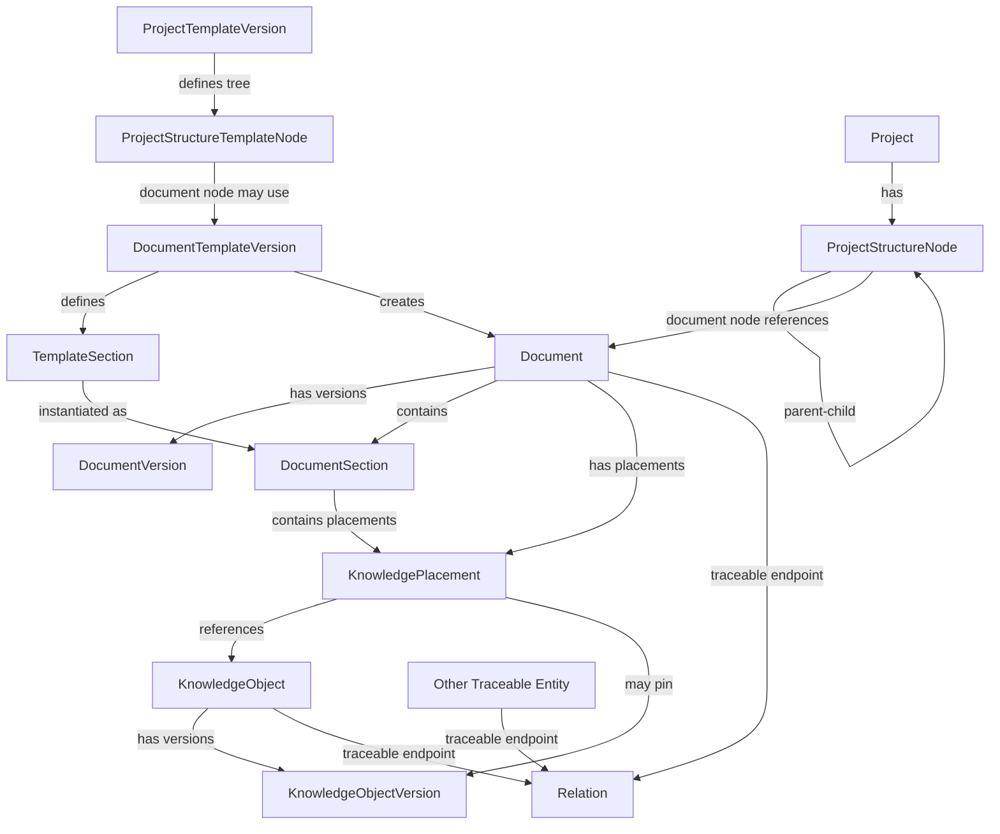
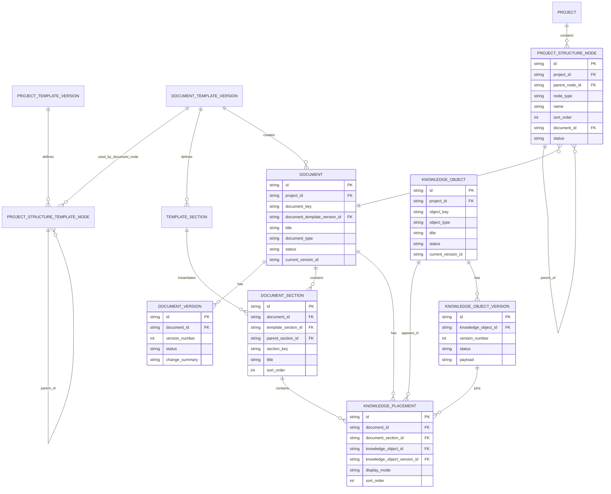

# Document & Project Structure — Entity Model

Tài liệu này mô tả phần **Project Structure + Document + Knowledge Placement** và boundary của chúng với Traceability Graph. Nó không định nghĩa toàn bộ SaaS domain; canonical cross-domain model nằm ở `APP-DOMAIN-MODEL.md`.

Điểm quan trọng nhất:

> **Folder/document hierarchy là structure/navigation tree. Semantic dependency là traceability graph. Không dùng một model để thay cho model kia.**

`docs/sample-project/` chỉ là acceptance fixture để kiểm tra app có thể biểu diễn một tree nhiều tầng gồm folder và document.

## 1. Conceptual model



## 2. Project Structure Tree

### 2.1 ProjectStructureTemplateNode

Dùng để định nghĩa structure tree trong `ProjectTemplateVersion`.

```text
ProjectStructureTemplateNode
- TemplateNodeId
- ProjectTemplateVersionId
- ParentTemplateNodeId?
- NodeType: Folder | Document
- Name
- SortOrder
- DocumentTemplateVersionId?
- Required
- Metadata
```

Document template node phải reference `DocumentTemplateVersion`. Folder node không reference document template.

### 2.2 ProjectStructureNode

Là node thực tế trong project.

```text
ProjectStructureNode
- StructureNodeId
- ProjectId
- ParentStructureNodeId?
- NodeType: Folder | Document
- Name
- SortOrder
- DocumentId?
- Status: Active | Archived
```

Structure node chịu trách nhiệm:

- folder/document tree;
- navigation;
- move/reorder;
- display path;
- export path projection.

Không đặt parent path vào `Document`. `Document` phải giữ identity ổn định khi node bị move/rename.

### 2.3 Structural invariants

1. Parent node phải cùng project.
2. Tree không cycle.
3. Folder node không có `DocumentId`.
4. Document node bắt buộc có `DocumentId` cùng project.
5. MVP chỉ có một primary structure node cho một Document.
6. `CanonicalPath` được derive từ tree; path không phải identity.
7. Move/rename/reorder không tự tạo semantic impact.

## 3. Document Template và Document

### 3.1 DocumentTemplateVersion

Định nghĩa content/section structure của một document, không định nghĩa vị trí của document trong project tree.

```text
DocumentTemplateVersion
- DocumentTemplateVersionId
- DocumentTemplateId
- Version
- SchemaVersion
- ContentTemplate
```

### 3.2 TemplateSection

```text
TemplateSection
- TemplateSectionId
- DocumentTemplateVersionId
- ParentTemplateSectionId?
- SectionKey
- Title
- SortOrder
- Required
```

### 3.3 Document

```text
Document
- DocumentId
- ProjectId
- Key
- Title
- DocumentType
- DocumentTemplateVersionId?
- Status
- CurrentVersionId
- OwnerMembershipId?
```

`Document` là authoring container và là traceable entity.

Không có `ParentDocumentId`; hierarchy thuộc `ProjectStructureNode`.

### 3.4 DocumentVersion

```text
DocumentVersion
- DocumentVersionId
- DocumentId
- VersionNumber
- Content
- Status
- ChangeSummary
- CreatedByPrincipalId
- CreatedAt
```

Document wording/layout change có lifecycle riêng với semantic objects được render trong document.

### 3.5 DocumentSection

```text
DocumentSection
- DocumentSectionId
- DocumentId
- TemplateSectionId?
- ParentDocumentSectionId?
- SectionKey
- Title
- SortOrder
```

## 4. Knowledge Object và Placement

### 4.1 KnowledgeObject

Semantic object có stable identity, ví dụ:

```text
GOAL-001
REQ-P2P-012
BR-P2P-006
AC-P2P-012-01
DES-P2P-005
API-P2P-007-SPEC
```

```text
KnowledgeObject
- KnowledgeObjectId
- ProjectId
- Key
- ObjectType
- Title
- Status
- CurrentVersionId
```

### 4.2 KnowledgeObjectVersion

```text
KnowledgeObjectVersion
- KnowledgeObjectVersionId
- KnowledgeObjectId
- VersionNumber
- Status
- Payload
- CreatedByPrincipalId
- CreatedAt
```

### 4.3 KnowledgePlacement

```text
KnowledgePlacement
- PlacementId
- KnowledgeObjectId
- KnowledgeObjectVersionId?
- DocumentId
- DocumentSectionId?
- Anchor?
- DisplayMode
- SortOrder
```

Placement cho biết **object được render ở đâu**.

Ví dụ một BusinessRule canonical có thể xuất hiện trong nhiều document:

```text
BR-P2P-006
├── placement → Requirement Document
├── placement → API Design Document
└── placement → Test Specification
```

Không copy BusinessRule thành nhiều object.

## 5. Traceability boundary

### 5.1 Relation không giới hạn ở KnowledgeObject

Tài liệu cũ từng mô hình `ObjectRelation` chỉ nối hai KnowledgeObjects. Điều đó không đủ cho sản phẩm vì impact graph phải đi xuyên qua Document, Requirement, Design, Deliverable, Task, Verification và Artifact.

Canonical model dùng generic endpoint:

```text
TraceableRef
- ProjectId
- EntityType
- EntityId
```

```text
Relation
- RelationId
- ProjectId
- FromEntityType
- FromEntityId
- RelationType
- ToEntityType
- ToEntityId
- FromVersionRef?
- ToVersionRef?
- Metadata
```

Endpoint có thể là:

```text
Document
KnowledgeObject
Deliverable
Task
VerificationDefinition
Milestone
ImplementationArtifact
ChangeRequest
...
```

### 5.2 Placement khác Relation

```text
KnowledgePlacement
→ object appears in document

Relation
→ object semantically depends on / requires / specifies / implements / verifies another object
```

Một placement không tự tạo relation semantic. Nếu Document A reference Document B vì một lý do traceability có ý nghĩa, tạo explicit `references` relation giữa hai Documents.

### 5.3 Structure parent-child khác Relation

Không tạo:

```text
Folder --contains--> Document
```

bằng traceability graph để thay cho structure tree. Parent-child của ProjectStructureNode đã là canonical source của navigation structure.

## 6. Logical ERD — document/structure scope



Generic `Relation` không được vẽ bằng FK trực tiếp tới từng entity type trong ERD này vì physical representation cần được quyết định ở detailed design. Conceptual requirement là relation endpoint phải resolve an toàn về traceable entity cùng Project.

## 7. Ba trục cần phân biệt

### 7.1 Structure axis

```text
Project
  ↓
ProjectStructureNode
  ↓ parent/child
Folder / DocumentNode
```

Trả lời: **document nằm ở đâu?**

### 7.2 Authoring axis

```text
Document
  ↓
DocumentSection
  ↓
KnowledgePlacement
  ↓
KnowledgeObject
```

Trả lời: **nội dung/semantic object được trình bày ở đâu?**

### 7.3 Traceability axis

```text
Traceable Entity
  ↕ Relation
Traceable Entity
```

Trả lời: **entity này tồn tại vì sao, phụ thuộc gì, được implement/verify bởi gì, và change sẽ ảnh hưởng tới đâu?**

## 8. Example

Project structure:

```text
20 Requirements/
└── Purchase Order Requirements.md  → DOC-P2P-REQ-001

30 Design/
└── Purchase Order API.md           → DOC-P2P-API-001
```

Placements:

```text
DOC-P2P-REQ-001
├── REQ-P2P-012
└── BR-P2P-006

DOC-P2P-API-001
├── API-P2P-007-SPEC
└── BR-P2P-006    # same canonical rule, second placement
```

Traceability:

```text
REQ-P2P-012 --governed-by--> BR-P2P-006
REQ-P2P-012 --requires-----> API-P2P-007
API-P2P-007-SPEC --specifies--> API-P2P-007
TASK-P2P-BE-042 --implements--> API-P2P-007
VER-P2P-012 --verifies--------> API-P2P-007
DOC-P2P-API-001 --references--> REQ-P2P-012   # optional semantic relation
```

Nếu document API được move sang folder khác, traceability không đổi. Nếu `REQ-P2P-012` đổi semantic version, impact engine có thể traverse relation tới API spec/deliverable/task/verification.

## 9. Required CRUD behavior

### Structure

- create folder/document node;
- rename;
- move;
- reorder;
- archive/restore;
- query tree/subtree/path.

### Document

- create blank/from template;
- edit/version;
- section CRUD;
- baseline/history/diff;
- placement CRUD.

### KnowledgeObject

- create/edit/version/archive;
- place/remove placement;
- query all placements.

### Relation

- create/delete/update metadata;
- validate relation type/source/target;
- query inbound/outbound;
- backlinks;
- traversal/impact.

## 10. Invariants

1. Structure tree không cycle.
2. Structure node parent/document cùng Project.
3. Document identity không phụ thuộc path.
4. Folder không phải Document.
5. DocumentVersion và KnowledgeObjectVersion độc lập.
6. Placement không phải Relation.
7. Structure parent-child không phải Relation.
8. Relation endpoint không giới hạn ở KnowledgeObject.
9. Reverse relation được generated từ canonical directed edge.
10. Baseline/reference history phải sống sót qua move/rename/archive.

> **Project Structure quản lý “where”; Document/Placement quản lý “how knowledge is authored”; Traceability Relation quản lý “why/how entities depend on each other”.**