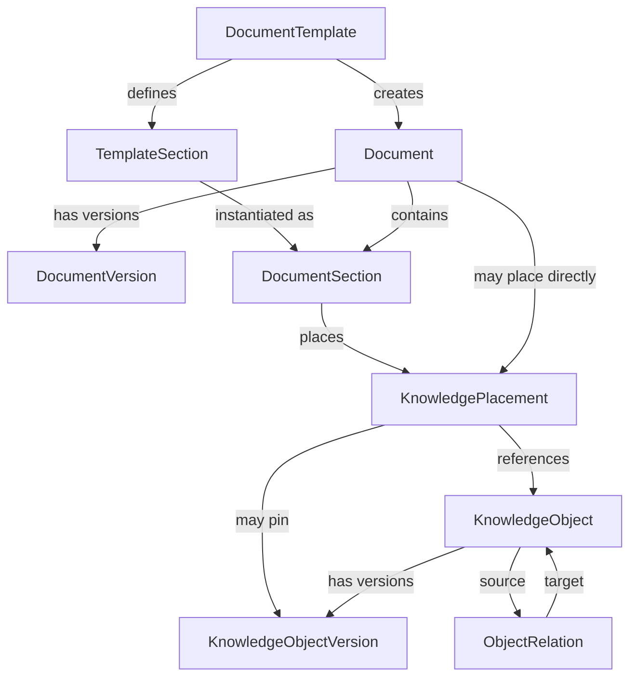
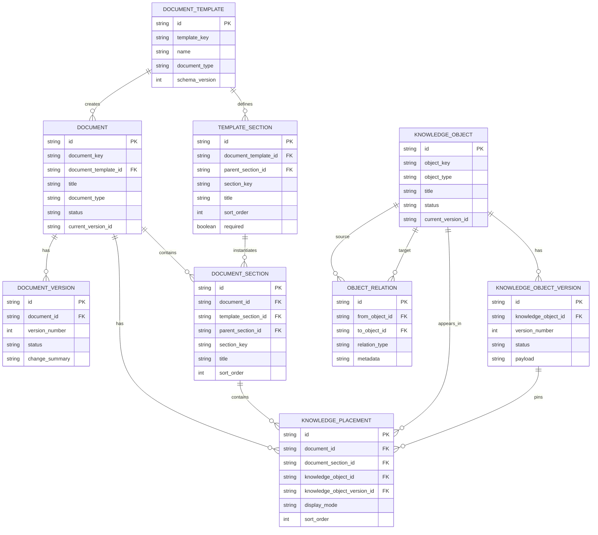

# Document Domain — Entity Relationship Model

Tài liệu này mô tả **quan hệ giữa các entity của phần quản lý tài liệu**. Phạm vi hiện tại chỉ tập trung vào document, template, structured knowledge object, version và relation; chưa đưa các concern SaaS như billing, authentication, subscription hay organization vào mô hình.

## 1. Conceptual entity map



## 2. Cách đọc mô hình

### DocumentTemplate

Định nghĩa cấu trúc chuẩn của một loại tài liệu, ví dụ Requirement Specification, API Specification, Screen Specification hoặc Architecture Overview.

### TemplateSection

Định nghĩa section chuẩn trong template. Một template có nhiều section và section có thể có cấu trúc cha-con.

Ví dụ:

```text
API Specification
├── Overview
├── Request
├── Response
├── Business Rules
└── Error Cases
```

### Document

Là identity logic của một tài liệu trong project. `Document` không đồng nghĩa với Requirement hay Design Object. Nó là container phục vụ authoring, navigation và rendering.

### DocumentVersion

Lưu lịch sử version của document. Việc thay wording, layout hoặc cấu trúc document có thể tạo `DocumentVersion` mới mà không nhất thiết làm thay đổi semantic version của mọi knowledge object bên trong.

### DocumentSection

Là section thực tế được tạo trong một document. Section có thể được sinh từ `TemplateSection`, nhưng sau khi tạo vẫn là entity riêng của document.

### KnowledgeObject

Là semantic object thực sự có ID ổn định và tham gia traceability graph.

Ví dụ:

```text
GOAL-001
REQ-P2P-012
BR-P2P-006
AC-P2P-012-01
DES-P2P-005
API-P2P-007-SPEC
```

### KnowledgeObjectVersion

Quản lý version semantic của một knowledge object. Ví dụ requirement đổi business meaning từ v4 sang v5 thì tạo version mới của `KnowledgeObject`, không chỉ tạo một `DocumentVersion` mới.

### KnowledgePlacement

Là entity trung gian cho biết một `KnowledgeObject` được hiển thị ở đâu trong document.

Nhờ entity này, cùng một Business Rule có thể xuất hiện trong nhiều tài liệu nhưng vẫn chỉ có một canonical semantic object.

```text
BR-P2P-006
   ├── appears in Requirement Document
   ├── appears in API Specification
   └── appears in Test Specification
```

### ObjectRelation

Là edge có cấu trúc nối hai `KnowledgeObject`.

Ví dụ:

```text
GOAL-001
    ↓ decomposes-to
REQ-P2P-012
    ↓ accepted-by
AC-P2P-012-01

REQ-P2P-012
    ↓ governed-by
BR-P2P-006

REQ-P2P-012
    ↓ satisfied-by
DES-P2P-005
```

`ObjectRelation` là source of truth của relation. Không lưu thêm reverse relation editable độc lập.

## 3. ERD mức logical database



## 4. Quan hệ quan trọng nhất

Mô hình có hai trục độc lập nhưng kết nối với nhau.

### Trục authoring

```text
DocumentTemplate
      ↓
Document
      ↓
DocumentSection
      ↓
KnowledgePlacement
```

Trục này trả lời câu hỏi: **nội dung được tổ chức và hiển thị ở đâu?**

### Trục semantic

```text
KnowledgeObject
      ↓
KnowledgeObjectVersion

KnowledgeObject
      ↕ ObjectRelation
KnowledgeObject
```

Trục này trả lời câu hỏi: **project đang biết những gì và các knowledge object liên quan với nhau như thế nào?**

`KnowledgePlacement` là cầu nối giữa hai trục.

## 5. Ví dụ thực tế

Giả sử project có document `DOC-P2P-REQ-001 — Purchase Order Requirements`.

```text
DOCUMENT
DOC-P2P-REQ-001
│
├── Section: Business Requirements
│      │
│      ├── Placement → REQ-P2P-012
│      └── Placement → REQ-P2P-013
│
└── Section: Business Rules
       │
       ├── Placement → BR-P2P-006
       └── Placement → BR-P2P-007
```

Nhưng semantic graph độc lập với document tree:

```text
GOAL-P2P-001
     ↓ decomposes-to
REQ-P2P-012
     ├── governed-by → BR-P2P-006
     ├── governed-by → BR-P2P-007
     └── accepted-by → AC-P2P-012-01
```

Nếu `BR-P2P-006` cũng cần xuất hiện trong API design document, chỉ tạo thêm một `KnowledgePlacement`. Không copy Business Rule thành object mới.

## 6. Nguyên tắc cần giữ

1. `Document` là container, không phải semantic source duy nhất.
2. Mọi object cần trace phải có `KnowledgeObject` và stable ID riêng.
3. `DocumentVersion` và `KnowledgeObjectVersion` là hai lifecycle khác nhau.
4. Một `KnowledgeObject` có thể xuất hiện ở nhiều document thông qua `KnowledgePlacement`.
5. Quan hệ semantic được quản lý bằng `ObjectRelation`, không suy luận từ vị trí trong folder/document.
6. Reverse relation phải được query từ canonical edge thay vì lưu hai bản editable.
7. Template định nghĩa cấu trúc mặc định nhưng không trở thành nơi lưu dữ liệu thực tế của document.
