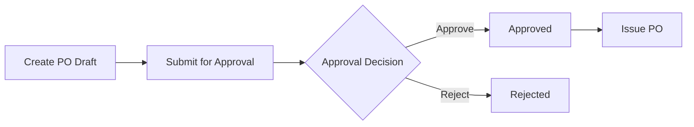
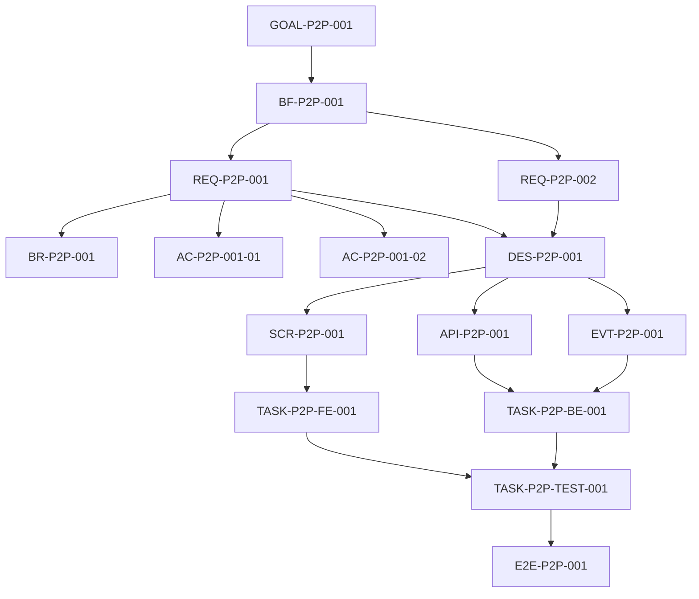

# Sample Project Document — Purchase Order Approval

> **Mục đích của file này**: minh họa một document được quản lý bởi Software Project Governance SaaS. Document là một view có cấu trúc của các object trong project. Các object như Goal, Requirement, Design Decision, Deliverable và Task có ID riêng, version riêng và có thể được reference từ nhiều document khác nhau.

---

## 0. Document Metadata

| Thuộc tính | Giá trị |
|---|---|
| Document ID | `DOC-P2P-001` |
| Document Type | `Feature Design & Delivery Document` |
| Project | `ERP-LAB` |
| Title | Purchase Order Approval |
| Version | `1.0` |
| Status | `Baseline` |
| Template | `TPL-FEATURE-DELIVERY-001` |
| Related Business Flow | `BF-P2P-001` |
| Primary Goal | `GOAL-P2P-001` |

### 0.1 Object Index

Document này đang hiển thị các structured object sau:

| Object ID | Type | Title |
|---|---|---|
| `GOAL-P2P-001` | Goal | Kiểm soát việc phát hành Purchase Order |
| `BF-P2P-001` | Business Flow | Purchase Requisition to Purchase Order |
| `REQ-P2P-001` | Requirement | PO phải được phê duyệt trước khi phát hành |
| `REQ-P2P-002` | Requirement | Người tạo PO không được tự phê duyệt |
| `BR-P2P-001` | Business Rule | Approval authority theo tổng giá trị PO |
| `AC-P2P-001-01` | Acceptance Criterion | Không thể issue PO chưa approved |
| `AC-P2P-001-02` | Acceptance Criterion | Approved PO được phép issue |
| `DES-P2P-001` | Design Decision | Tách approval thành command riêng |
| `SCR-P2P-001` | Deliverable / Screen | Purchase Order Detail |
| `API-P2P-001` | Deliverable / API | Approve Purchase Order API |
| `EVT-P2P-001` | Deliverable / Event | PurchaseOrderApproved |
| `TASK-P2P-FE-001` | Task | Implement approval UI |
| `TASK-P2P-BE-001` | Task | Implement approval API |
| `TASK-P2P-TEST-001` | Task | Implement approval E2E test |
| `E2E-P2P-001` | Verification Definition | PO approval end-to-end scenario |

---

# 1. Project Context

ERP-LAB là hệ thống mô phỏng vận hành doanh nghiệp. Trong luồng Procure-to-Pay, Purchase Order là cam kết mua hàng chính thức với supplier. Vì vậy việc phát hành PO phải được kiểm soát bằng approval workflow thay vì cho phép mọi người tạo và phát hành trực tiếp.

Document này chỉ mô tả phạm vi **Purchase Order Approval**. Các phần như Purchase Requisition, Goods Receipt, Invoice Matching và Accounting Posting nằm ngoài phạm vi của document này nhưng có thể liên kết tới cùng Business Flow ở mức project.

---

# 2. Goal

## GOAL-P2P-001 — Kiểm soát việc phát hành Purchase Order

**Type:** `Business Goal`  
**Status:** `Baseline`  
**Version:** `2`  

### Mục tiêu

Mọi Purchase Order phải trải qua kiểm soát phê duyệt phù hợp trước khi trở thành cam kết chính thức với supplier.

### Success Conditions

- Không có PO chưa được phê duyệt nào được phát hành.
- Người tạo PO không thể tự phê duyệt PO do chính mình tạo.
- Quyền phê duyệt có thể thay đổi theo tổng giá trị PO.
- Có audit trail cho toàn bộ hành động submit, approve, reject và issue.

### Quan hệ

```text
GOAL-P2P-001
  └── decomposes-to → BF-P2P-001
```

---

# 3. Business Flow

## BF-P2P-001 — Purchase Requisition to Purchase Order

**Type:** `Business Flow`  
**Status:** `Baseline`  
**Version:** `3`  

### Flow tổng quát



### Actors

| Actor | Responsibility |
|---|---|
| Buyer | Tạo và submit Purchase Order |
| Approver | Review và approve/reject PO |
| Procurement Manager | Quản lý approval policy |
| System | Enforce state transition và audit trail |

### Requirement được phân rã từ flow

```text
BF-P2P-001
  ├── decomposes-to → REQ-P2P-001
  └── decomposes-to → REQ-P2P-002
```

---

# 4. Requirements

## REQ-P2P-001 — PO phải được phê duyệt trước khi phát hành

**Type:** `Functional Requirement`  
**Status:** `Baseline`  
**Version:** `4`  
**Source:** `BF-P2P-001`  

### Requirement Statement

Hệ thống chỉ cho phép phát hành Purchase Order khi PO đang ở trạng thái `Approved`.

### Input

- Purchase Order ID.
- Current Purchase Order status.
- Current actor.

### Expected Behavior

Nếu PO chưa ở trạng thái `Approved`, hành động Issue phải bị từ chối. Nếu PO đã được approve và các validation khác hợp lệ, PO được phép chuyển sang trạng thái `Issued`.

### Related Business Rules

- `BR-P2P-001` — Approval authority theo tổng giá trị PO.

### Acceptance Criteria

#### AC-P2P-001-01 — Không thể issue PO chưa approved

```gherkin
Given Purchase Order PO-1001 đang ở trạng thái PendingApproval
When Buyer thực hiện Issue
Then hệ thống từ chối thao tác
And Purchase Order vẫn giữ trạng thái PendingApproval
```

#### AC-P2P-001-02 — Approved PO được phép issue

```gherkin
Given Purchase Order PO-1001 đang ở trạng thái Approved
When Buyer thực hiện Issue
Then Purchase Order chuyển sang trạng thái Issued
And audit log ghi nhận hành động Issue
```

### Relations

```text
REQ-P2P-001
  ├── governed-by → BR-P2P-001
  ├── accepted-by → AC-P2P-001-01
  ├── accepted-by → AC-P2P-001-02
  └── satisfied-by → DES-P2P-001
```

---

## REQ-P2P-002 — Người tạo PO không được tự phê duyệt

**Type:** `Functional Requirement`  
**Status:** `Baseline`  
**Version:** `2`  
**Source:** `BF-P2P-001`  

### Requirement Statement

User đã tạo Purchase Order không được phép approve chính Purchase Order đó.

### Acceptance Criterion

```text
Given PO-1001 được tạo bởi USER-BUYER-001
When USER-BUYER-001 gọi hành động Approve
Then hệ thống từ chối với lỗi APPROVER_MUST_DIFFER_FROM_CREATOR
```

### Relations

```text
REQ-P2P-002
  └── satisfied-by → DES-P2P-001
```

---

# 5. Business Rules

## BR-P2P-001 — Approval authority theo tổng giá trị PO

**Type:** `Business Rule`  
**Status:** `Baseline`  
**Version:** `1`  

| Total Amount | Required Authority |
|---:|---|
| `< 100,000,000 VND` | Procurement Approver |
| `100,000,000 – 499,999,999 VND` | Procurement Manager |
| `>= 500,000,000 VND` | Procurement Director |

> Đây là business rule canonical. Screen, API và task không được copy rule này thành một bản logic độc lập. Chúng reference `BR-P2P-001`.

---

# 6. Design Decision

## DES-P2P-001 — Tách approval thành command riêng

**Type:** `Design Decision`  
**Status:** `Baseline`  
**Version:** `2`  
**Satisfies:** `REQ-P2P-001`, `REQ-P2P-002`  

### Context

Approval là business action có authorization, business rule, state transition và audit requirement riêng. Nếu gộp approval vào generic PO update API thì boundary khó kiểm soát và audit intent không rõ ràng.

### Decision

Hệ thống sử dụng một command riêng `ApprovePurchaseOrder` và expose command này qua một API endpoint riêng.

### Resulting Deliverables

Design decision này tạo ra ba deliverable:

| Deliverable ID | Type | Name | Purpose |
|---|---|---|---|
| `SCR-P2P-001` | Screen | Purchase Order Detail | Hiển thị action Approve/Reject theo quyền |
| `API-P2P-001` | API | Approve Purchase Order API | Thực thi approval command |
| `EVT-P2P-001` | Event | PurchaseOrderApproved | Thông báo PO đã được approve |

### Relations

```text
DES-P2P-001
  ├── introduces → SCR-P2P-001
  ├── introduces → API-P2P-001
  └── introduces → EVT-P2P-001
```

---

# 7. Deliverables

## 7.1 SCR-P2P-001 — Purchase Order Detail

**Type:** `Screen`  
**Status:** `Specified`  
**Version:** `1`  

### Required UI behavior

Screen phải hiển thị:

- Purchase Order header.
- Supplier.
- Line items.
- Total amount.
- Current approval status.
- Approval history.
- `Approve` action nếu current user có quyền.
- `Reject` action nếu current user có quyền.

Action `Approve` không được hiển thị nếu current user là creator của PO.

### Related objects

```text
DES-P2P-001 → introduces → SCR-P2P-001
TASK-P2P-FE-001 → implements → SCR-P2P-001
```

---

## 7.2 API-P2P-001 — Approve Purchase Order API

**Type:** `API`  
**Status:** `Specified`  
**Version:** `2`  

### Contract

```http
POST /api/purchase-orders/{purchaseOrderId}/approve
```

Request:

```json
{
  "comment": "Approved for purchasing"
}
```

Successful response:

```json
{
  "purchaseOrderId": "PO-1001",
  "status": "Approved",
  "approvedBy": "USER-APR-001"
}
```

### Mandatory validations

1. PO tồn tại.
2. PO đang ở trạng thái `PendingApproval`.
3. Approver khác creator.
4. Approver có authority thỏa `BR-P2P-001`.
5. Approval action được ghi audit log.

### Related objects

```text
DES-P2P-001 → introduces → API-P2P-001
TASK-P2P-BE-001 → implements → API-P2P-001
E2E-P2P-001 → verifies → API-P2P-001
```

---

## 7.3 EVT-P2P-001 — PurchaseOrderApproved

**Type:** `Event`  
**Status:** `Specified`  
**Version:** `1`  

### Payload

```json
{
  "eventId": "...",
  "occurredAt": "...",
  "purchaseOrderId": "PO-1001",
  "approvedBy": "USER-APR-001",
  "approvedAt": "...",
  "totalAmount": 250000000,
  "currency": "VND"
}
```

### Purpose

Event được publish sau khi transaction approval thành công để các module khác có thể phản ứng mà không phụ thuộc trực tiếp vào Procurement module.

---

# 8. Task Plan

## 8.1 Task Overview

| Task ID | Title | Implements | Depends On | Status |
|---|---|---|---|---|
| `TASK-P2P-BE-001` | Implement PO approval backend | `API-P2P-001`, `EVT-P2P-001` | — | Ready |
| `TASK-P2P-FE-001` | Implement PO approval UI | `SCR-P2P-001` | API contract baseline | Ready |
| `TASK-P2P-TEST-001` | Implement PO approval E2E | `E2E-P2P-001` | FE + BE implementation | Blocked |

---

## 8.2 TASK-P2P-BE-001 — Implement PO approval backend

**Type:** `Backend`  
**Status:** `Ready`  
**Priority:** `High`  

### Objective

Implement approval behavior theo `REQ-P2P-001`, `REQ-P2P-002`, `BR-P2P-001` và contract `API-P2P-001`.

### Mandatory Read Set

```text
REQ-P2P-001 v4
REQ-P2P-002 v2
BR-P2P-001 v1
DES-P2P-001 v2
API-P2P-001 v2
EVT-P2P-001 v1
AC-P2P-001-01
AC-P2P-001-02
```

### Write Scope

```text
API-P2P-001     action=implement
EVT-P2P-001     action=implement
```

### Expected implementation artifacts

- Application command/handler cho `ApprovePurchaseOrder`.
- Domain validation/state transition.
- API endpoint.
- Event publisher.
- Unit tests.
- Integration tests.

### Done Conditions

- API implementation phù hợp contract `API-P2P-001 v2`.
- Không cho creator tự approve.
- Authority rule `BR-P2P-001` được enforce.
- Event `EVT-P2P-001` chỉ publish sau successful approval.
- Required tests pass.
- Task result có link tới commit/PR/artifacts.

---

## 8.3 TASK-P2P-FE-001 — Implement PO approval UI

**Type:** `Frontend`  
**Status:** `Ready`  

### Mandatory Read Set

```text
REQ-P2P-001 v4
REQ-P2P-002 v2
SCR-P2P-001 v1
API-P2P-001 v2
```

### Write Scope

```text
SCR-P2P-001     action=implement
```

### Done Conditions

- Approve/Reject actions hiển thị đúng theo permission và PO state.
- Creator không thấy action Approve cho PO của chính mình.
- UI gọi đúng contract `API-P2P-001 v2`.
- Error từ backend được hiển thị rõ ràng.

---

# 9. Verification

## E2E-P2P-001 — Purchase Order Approval End-to-End

**Type:** `E2E Verification Definition`  
**Status:** `Baseline`  

### Scenario A — Successful approval

```text
Create PO as Buyer
→ Submit PO for approval
→ Login as authorized Approver
→ Open Purchase Order Detail
→ Approve
→ Verify status = Approved
→ Verify approval audit entry exists
→ Verify PurchaseOrderApproved event was emitted
```

### Scenario B — Self approval is rejected

```text
Create PO as Buyer A
→ Submit PO for approval
→ Attempt approval as Buyer A
→ Verify approval is rejected
→ Verify status remains PendingApproval
```

### Verification Targets

```text
E2E-P2P-001
  ├── verifies → REQ-P2P-001
  ├── verifies → REQ-P2P-002
  ├── verifies → SCR-P2P-001
  └── verifies → API-P2P-001
```

---

# 10. Traceability Matrix

| Goal / Flow | Requirement | Design | Deliverable | Task | Verification |
|---|---|---|---|---|---|
| `GOAL-P2P-001` / `BF-P2P-001` | `REQ-P2P-001` | `DES-P2P-001` | `API-P2P-001` | `TASK-P2P-BE-001` | `E2E-P2P-001` |
| `GOAL-P2P-001` / `BF-P2P-001` | `REQ-P2P-001` | `DES-P2P-001` | `SCR-P2P-001` | `TASK-P2P-FE-001` | `E2E-P2P-001` |
| `GOAL-P2P-001` / `BF-P2P-001` | `REQ-P2P-002` | `DES-P2P-001` | `API-P2P-001` | `TASK-P2P-BE-001` | `E2E-P2P-001` |
| `GOAL-P2P-001` / `BF-P2P-001` | `REQ-P2P-001` | `DES-P2P-001` | `EVT-P2P-001` | `TASK-P2P-BE-001` | `E2E-P2P-001` |

---

# 11. Full Drill-down View



Document này chỉ là một **rendered view**. Trong app, các node trên phải tồn tại như object có identity riêng và các edge phải tồn tại như relation data. Vì vậy cùng `REQ-P2P-001` có thể xuất hiện trong document này, Requirement Catalog, API Design document hoặc Change Impact view mà không tạo ra bốn requirement khác nhau.

---

# 12. Ví dụ khi Requirement thay đổi

Giả sử business thay đổi `REQ-P2P-001` từ:

```text
PO phải Approved trước khi Issue.
```

thành:

```text
PO có tổng giá trị >= 500,000,000 VND cần hai cấp approval trước khi Issue.
```

App không được chỉ sửa một đoạn text trong document này. Quy trình mong muốn là:

```text
REQ-P2P-001 v4
      ↓ change
REQ-P2P-001 v5
      ↓ impact traversal
DES-P2P-001
API-P2P-001
SCR-P2P-001
EVT-P2P-001
TASK-P2P-BE-001
TASK-P2P-FE-001
E2E-P2P-001
      ↓
Review / Update / Revalidate / No Change Required
```

Ví dụ disposition:

| Object | Impact | Reason |
|---|---|---|
| `DES-P2P-001` | Update Required | Approval model thay đổi từ single-level sang multi-level |
| `API-P2P-001` | Review Required | Có thể cần thay response/state contract |
| `SCR-P2P-001` | Update Required | UI phải hiển thị approval level/history |
| `EVT-P2P-001` | Review Required | Event semantic có thể cần thêm approval level |
| `E2E-P2P-001` | Revalidation Required | Test scenario phải bổ sung two-level approval |

---

# 13. Ý nghĩa của sample này đối với app

Document này cố ý minh họa bốn nguyên tắc:

1. **Document không phải database của project.** Nó là một view có cấu trúc của các object có ID.
2. **Mỗi semantic object có identity riêng.** Requirement, rule, design, deliverable, task và verification không bị hòa thành prose.
3. **Relation là dữ liệu first-class.** Có thể drill-down và impact analysis mà không cần AI đọc toàn bộ văn bản để suy luận.
4. **Task là execution unit cuối của chuỗi planning.** Task phải truy ngược được về requirement và goal, đồng thời biết chính xác context cần đọc và deliverable cần thay đổi.
